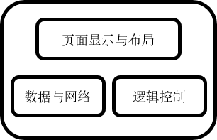
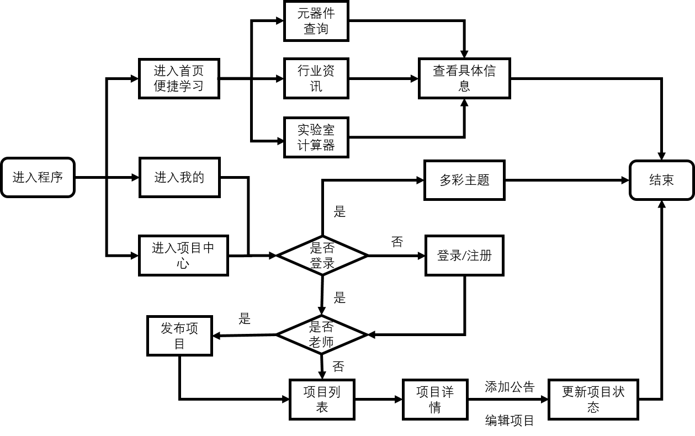
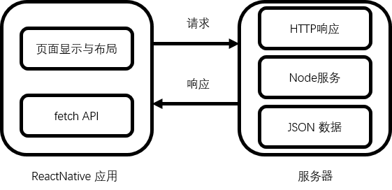
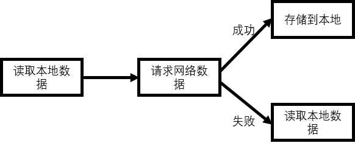
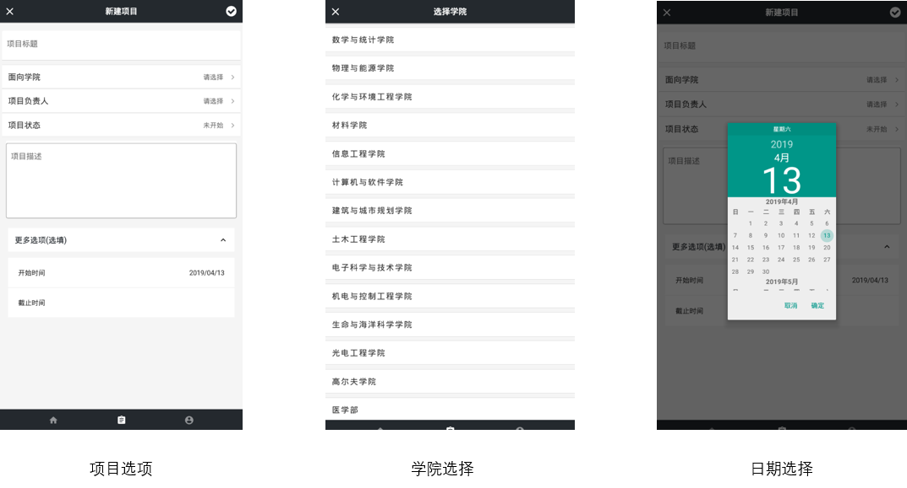
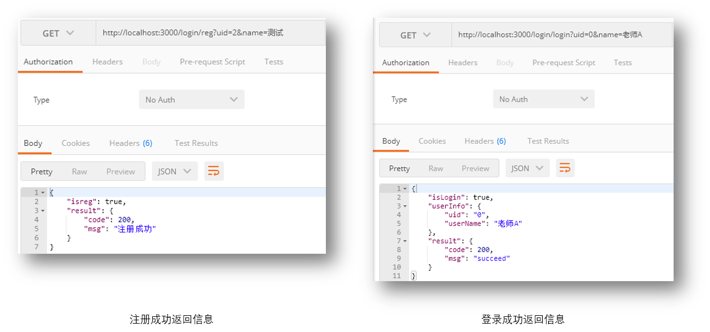

# 修改前：13087

## 摘要
随着互联网的兴起，移动应用在 Android 和 iOS 平台上的开发趋势日益火热。不少高校也加快校园信息化建设，推出了互联网+ 智慧校园的发展规划。然而，传统的 Android 或者 iOS 开发模式在面对日益多样化的移动终端诸如各种形式的安卓手机、平板以及iPhone等，不得不选择了多种平台重复开发的方案。而2015 年 Facebook 推出了一款名为 ReactNative 的基于 Javascript 构建原生应用的框架，它强调了“一次学习，随处可写”，并提出了组件化开发的思想，从而解决了传统开发模式中代码无法复用的难题。
  
论文研究内容正是基于 ReactNative 技术致力于在 Android 系统上为高校提供本科实验室便捷学习平台以及项目跟踪管理的辅助程序。程序主要包括以下三大核心功能模块，依次为：便捷学习模块、项目管理模块以及用户登录模块。程序使用 VS Code 编辑器 作为开发的 IDE ，通过ReactNative 框架实现移动 App 的页面布局设计以及业务逻辑。后端服务器则选择 Node.JS + Express + Mysql 这一轻量级组合来完成业务所需求的存储功能。程序最终经过 Android 平台多端的测试，实现了多端适配，符合预期业务需求，达到了预期效果。

【关键字】： 实验室；ReactNative；学习辅助；项目追踪管理；


## 一. 引言
### 1.1 课题来源及研究目的和意义

自 4G 网络正式普及以来，移动互联网的高速发展离不开智能终端的普及应用。国内诸如华为、小米、OPPO等安卓手机以相比较于 iPhone 更易于让大多数人接受的价格迅速占领手机市场份额，而国内微信、支付宝等移动应用的出现更是让国人离不开手机所带来的便捷生活方式。据《中国互联网络发展状况统计报告》中指出，中国上网用户早已达到了 7.1  亿，其中手机上网用户便高达 90% 以上，在庞大的用户规模以及其背后所形成的巨大利益需求链的驱使下，移动手机应用层出不穷、蓬勃发展，迅速占领人们日常生活的方方面面。随着移动互联网技术不断的更新迭代，也使得移动互联网络相比以前变得更加多样化、立体化，移动互联网产品的快速发展，与移动互联网相辅相成，将使我们生活在一个高效、互联的网络时代。

在 2015 年 Facebook 正式宣布 ReactNative 开源使用后，其组件化的思想以及高度的复用性和可拓展性使得ReactNative在软件开发者群体中越来越受欢迎，是当前移动软件开发中名列前茅的技术。ReactNative 使用 React 库 以及 JavaScript 编写和构建原生移动应用，通过声明式的组件机制来搭建丰富多彩的用户界面，并可以完美兼容与使用 Object-C、Java 或者 Swift 原生编写的组件进行混合开发，可以带来极佳用户体验。论文选题内容正是基于ReactNative 技术，致力于在 Android 系统上构建一款高校本科实验室便捷学习以及项目跟踪管理的学习辅助程序，让高校学生在实验室自由探索学习的同时，可以更加便捷的使用该程序进行资料查询和及时反馈老师发布的项目进度，对学生的个人快速成长以及实验室项目规范管理有重大意义。

### 1.2 移动开发国内外研究现状

当前的国内外主流的移动App开发模式主要有传统开发模式的 Native App 开发模式、Web App 开发模式和 Hybrid App 开发模式以及最近热门的 ReactNative 开发模式。

1.2.1 Native App 开发模式

即传统的原生 App 开发模式，开发出来即是原生应用程序。在 Android 系统上使用 Java 语言进行开发而在 iOS 系统上则一般选择使用 Swift 或者Object-C 语言进行开发，编译之后的代码可以直接运行在系统底层，并可以调用系统底层 API 能带来最佳的用户体验。经过开发出来的程序是一个独立的 App 且可以发布到各大应用商店。

Native App 开发模式的优点在于编写出来的代码直接依托于手机操作系统，能够给用户提供最优质的界面交互体验，性能在相比较于其他的开发模式是最好的。由于可以直接调用官方提供的底层API，使得其可以充分利用系统资源条件，可以进行本地资源的操作、通知以及渲染复杂的动画，功能强大。

但是 Native App 开发模式的缺点也比较明显。一方面由于 Android 和 iOS 编写语言、平台的不同使得应用的开发成本相比于其他模式要高。企业不得不在保证两个平台间应用功能的一致性前提下，分配各自系统的开发人员，耗费大量人力；另一方面应用发布上线后，应用无法进行及时的更新迭代。这是因为在 iOS 中发布到 AppStore 上的应用，必须通过 AppStore 的地址进行更新而且每次都需要进行额外的应用审核从而无法达到及时更新的效果，而在 Android 系统中，用户也只能通过重新下载整包的应用 Apk 进行更新迭代的操作。在这样繁琐的条件限制下，不论是项目的更新还是之后上线的维护都显得较为复杂。


1.2.2 Web App 开发模式

即网页开发模式,通过前端开发人员使用 HTML + CSS + JS 组合编写页面并将其部署在相应的务器上，而后用户直接通过浏览器访问即可使用，如我们常见到的京东主页以及手机爱淘宝主页。Web App 可通过浏览器直接访问的特点使得其具备跨Android、iOS双平台的能力，而页面的更新维护也能通过前端人员的代码重写调试后重新部署到服务器上来实现，因此在解决了用户手机端缓存问题的前提下，它拥有着最快的更新速度同时也便于维护。但另一方面，也正是Web App开发出来的应用直接在浏览器上运行，在网络不稳定页面访问速度慢的情况下，用户体验非常糟糕，而在网络正常的情况下也可能存在网站优化不佳消耗用户流量的隐患。另外，通过使用HTML5中自带的API实现出来的 Web App，不是一个独立的 App，无法发布到 AppStore 上，其功能也因为无法充分调用系统API而受到了极大的限制。


1.2.3 Hybrid App 开发模式

即混合开发模式，也就是半原生半Web的开发模式。通过在原生应用上内嵌一个WebView，由 Native 调用 JSBridge 提供的 API 渲染前端人员开发的Web 页面，不需要两个独立的开发人员，开发成本较低。而且混合开发模式不仅具备网页开发模式的跨平台优点，更新也比原生开发模式相对地自由。这其中根本原因在于通过前端人员更新 Web 部分地资源文件，就可以不需要再重新打包应用 apk ，当然更新效率来说还是 Web App 开发模式更胜一筹。此外，混合开发的应用编译之后的应用仍然是一款独立的原生应用，所以通过原生调用API使得其在性能体验方面要比 Web App 好很多，但在一些交互性比较强或者复杂动画效果的页面上，其性能受限于WebView的束缚，用户体验也不如原生App，容易出现卡顿、崩溃等现象。

1.2.4 ReactNative 开发模式

ReactNative （以下称 RN ）是 Facebook 发布一种新型App开发模式，可以让广大开发者使用 React 库（2013年Facebook推出的一款开源UI库）以及 JavaScript 框架编写开发移动应用，同时提倡开发者进行组件化开发，其核心思想是“ Learn once, write anywhere. ”，即学习一次编写任何平台，开发人员能够完成多平台业务场景的开发。官方提供了一些自带组件给开发者，开发者也可以嵌套使用官方组件构建新的组件并发布，从而提高复用性。

不同于之前提到的三种 App 开发模式，RN 使用 JSX 语法糖结合底层原生语法来实现相应的应用功能，从而解决了Hybrid App 以及 Web App 被诟病已久的糟糕的用户体验以及功能受限问题。而在UI设计上，RN 采用 Flexbox 弹性布局，这是一种基于CSS的跨平台的布局模式，可以快速的进行页面布局以及适配不同分辨率屏幕的手机机型。通过在 JS 中使用 React 库抽象出操作系统的原生UI组件，代替 DOM 元素来渲染界面并将底层的业务逻辑通过调用系统原生API实现，使得 RN 开发出来的应用性能体验十分接近于原生开发，同时又保持着 Web APP 的高效快捷的开发效率。这也是本文排除其他App 开发模式而热衷于 ReactNative 开发的根本原因。 

RN 相比于 web 开发或者原生开发有以下优势：
- 通过虚拟 DOM 和 Diff 算法进行动态更新，可以实现产品的快速迭代以及更新发布而不用再等待漫长的应用编译；
- 性能体验高于 Hybrid ,不逊色于原生，而且能够实现较为复杂的交互以及动画效果；
- 代码复用率高，一套代码基本可以同时运行在 Android 、iOS 两个平台；
- 使用 React + JS 构建出来的 UI 代码可直接在浏览器的开发者工具中进行调试；
- 有着较为完善的开发者社区，便于新手学习。

当然它也有不完美的地方：
- RN 自2015年发布以来一直都没有发布1.0版本，不断的更新迭代这也意味着在项目使用 RN 时需要承担一些风险；
- RN 的开发准备周期较长，在开发过程中也容易出现由于组件版本不同所带来的红屏错误。
- RN 没有完善的项目日志跟踪工具以及相应的后期上线测试、维护工具，稳定性也不强容易出现应用崩溃的Bug。

### 1.3 论文主要内容

论文选题内容正是基于 ReactNative 技术，致力于在 Android 系统上构建一款高校本科实验室便捷学习以及项目跟踪管理的学习辅助程序。程序主要包含三大核心功能模块：便捷学习、项目跟踪管理、用户注册登录。论文着重设计并实现项目跟踪管理模块，在完成基本项目跟踪管理的同时，对功能细节进行改进完善，力求能给用户带来友好便捷的交互方式。该学习辅助程序的研究内容主要包括以下部分：
  1. 便捷学习模块
    该功能出发点是为高校学生建立一个课下的学习平台，功能场景主要是在高校的本科实验室。重点设计实现了元器件数据手册查询功能、行业资讯以及实验室用计算器工具，可以让高校学生在实验室的学习不再受限于常用工具诸如万用表等的数量，并且可以随时了解自己专业的现状与发展趋势。
  2. 项目跟踪管理
    项目跟踪管理模块在借鉴 Github 的版本管理模式下，主要进行项目发布、项目列表、项目详情、项目公告、项目实时动态更新以及项目权限设置。其中项目的实时动态会用户改动项目时记录下操作人、操作时间以及具体的操作内容。最大程度方便项目管理者与项目负责人间的沟通交流，以及同步了解项目的实时进度，对项目的进度跟进有着重大意义。
  3. 用户登录
    主要子功能模块包括登录提示、登录切换页面，并在构建好用户个人中心的基础上添加了多彩主题功能，可以让用户随时更换自己喜欢的颜色作为应用的颜色基调，提升用户体验。
  4. ReactNative 服务器端处理
    通过对服务器语言的优劣分析，最终使用 Node.JS + Express + MySQL 作为 RN 服务器语言，具体实现了注册登录模块以及数据的查询、添加、更新和删除功能并最终从本地部署到了腾讯云。

### 1.4 本章小结
  通过介绍基于 ReactNative 的学习辅助程序的研究背景、目的和意义，进一步分析了当前国内外的移动应用开发模式的现状以及传统移动应用开发模式与新型的ReactNative开发模式的优劣对比，最终引出了论文的主要研究内容。

## 二. ReactNative 学习辅助程序的整体设计
  程序的总体设计并没有涉及到太过复杂点的系统和理论，通过对论文课题需求的了解、分析从而确定程序的功能，再进一步确定程序的整体结构、划分功能模块。

  其中，应用整体结构如下所示。应用的整体结构主要包括页面显示与布局结构、数据与网络通信结构以及业务流程中的逻辑控制结构

  接下来就详细分析应用的各个结构组成部分展开以下内容。

  


### 2.1 程序工程项目结构
  在项目开发管理中，一般为了方便代码的管理与维护，开发者会将同类业务的文件放在同一目录下，这种模块化的开发思路可以帮助我们有效减少代码耦合、循环依赖，以此提高程序的开发效率。为了说明本项目的模块划分思路，首先介绍下该项目的代码结构。如图所示：

  
  
各文件夹的功能划分如下：

  |名称|功能描述|
  |:--:|:--:|
  |android|Android文件所在目录，包含 Android Studio 项目环境文件|
  |app|自定义组件所在目录，包含 common、Home、My 以及Task模块 |
  |ios|iOS文件所在目录，里面包含 Xcode 项目环境文件|
  |node_modules|基于 node 文件依赖系统产生的相关依赖和第三方库|
  |.buckconfig|buck的配置文件，buck是Facebook开源的高效编译系统|
  |.flowconfig|flow的配置文件，用于代码静态检查|
  |.watchmanconfig|Watchman 的配置文件，用于监控文件变化|
  |index.js|Android 和 iOS 应用的程序入口文件|
  |package.json|项目的基本信息以及第三方库的依赖信息|

其中重点对含有自定义组件的app文件夹，做详细介绍。
  - common： 存放封装的自定义组件以及公共组件
  - Home：主页面首页模块，包括元器件查询模块、实验室用计算器模块以及一些辅助教学功能。
  - My： 我的页面模块，包括用户登录以及多彩主题。
  - Task: 项目中心页面模块，主要包括项目发布、项目列表、项目状态更新等功能模块。

在软件开发过程中，为了达到快速开发的目的，常常需要在官方组件的基础上引入一些性能相对高效，并且使用便捷的第三方库。在本项目中，package.json 中引入的第三方库如下：
```js
    // 名称：所需版本号
    "react-native-check-box": "^2.1.7",
    "react-native-modal-datetime-picker": "^6.1.0",
    "react-native-paper": "^2.4.0",
    "react-native-pdf": "^5.0.11",
    "react-native-picker": "^4.3.7",
    "react-native-scrollable-tab-view": "^0.10.0",
    "react-native-step-indicator": "0.0.9",
    "react-native-swipeout": "^2.3.6",
    "react-native-swiper": "^1.5.14",
    "react-native-vector-icons": "^6.1.0",
    "react-navigation": "^3.0.9",
```
其中，使用频率较高的第三方库提供的主要功能描述如下。
  - react-navigation：提供页面间导航效果，实现底部Tab栏
  - react-native-vector-icons：提供常用的应用内图标
  - react-native-swiper：提供轮播效果
  - react-native-scrollable-tab-view： 提供可滑动的页内Tab视图

合理的使用第三方库，不但可以提高项目的开发效率，还能解决程序一些在持续迭代过程中出现的性能问题。

其中 common 文件夹内容为程序使用的公共组件，即各模块间频繁使用的共有组件。以页面导航栏的返回按钮（BackButton.js 文件）以及数据配置文件（config.js 文件）为例进行介绍。
  -  返回按钮

  使用一个可点击的组件 TouchableOpacity 进行外部封装，内部组成是一个图标。点击图标后返回上一层，按钮的图标可通过各个页面调用该组件时时传递的 name 属性进行动态设置，如返回图标 '<' 或者关闭图标 ‘x’ 。
  ```js
  <TouchableOpacity onPress={()=>{props.pop()}} style={{ marginLeft: 10}}>
    <Icon name={props.name} size={28} color={'#fff'}/>
  </TouchableOpacity>
  ```
  -  数据配置文件
  
  主要存放一些静态配置，包括实验室用计算器的基础数据、用户中心的多彩主题设置等。

  ```js
  // 导出数据
  module.exports = {
    _height:height,
    _width:width,
    ResisterFour,
    ResisterFive,
    exdata,
    user,
    customColor,
    tools_data,
    BannerList,
    stepIndicatorStyles
  }
  ```
### 2.2 程序页面布局结构
在页面开发过程中，使用了 Flexbox 布局进行了程序的总体页面设计。以各个主模块的首页为例，整体布局如下：


Flexbox布局是ReactNative开发的基础和重点，使用 Flexbox 布局，可以大大节约设计和开发成本，有效提高开发效率。Flexbox 布局常用属性以及部分常用的值如下：
- Flex Direction：决定布局的主轴。默认值为 'column' ，表示竖直轴，若为 'row' 则为水平轴。
- Justify Content：决定子元素在其父元素上的主轴排列方式。默认值为 'flex-start'，表示靠近主轴起始端分布，若为 'flex-end' 则为靠近主轴末端分布，值为 'space-around' 则代表沿着主轴均匀分布。
- Align Items：决定子元素在其父元素上的次轴（垂直于主轴）上的排列方式。默认值为 'flex-start'，表示沿着次轴起始端分布，值为 'center' 则表示沿着次轴中点向两侧分布。

### 2.3 程序的逻辑结构
在了解了项目工程结构以及页面布局之后，接下来介绍程序启动后的交互逻辑流程结构。



进入程序后，首先进入到首页的便捷学习模块，它包括三个部分即元器件查询部分、行业资讯以及实验室用计算器，点击任何一个部分都会跳转到相应的功能页面。点击底部 Tab 导航栏可以切换到我的和项目页。在进入这两个页面前，未登录状态会有登录提示，登录后用户可进行应用的主题设置以及使用项目跟踪管理功能。项目管理功能分为管理者（如老师A）和项目负责人，管理者可以发布和删除项目，发布项目后双方都可看到项目列表并进行相应的项目操作。其中页面的单击跳转都是由react-navigation 导航第三方库提供的navigate方法实现。列表页面则是通过官方提供的FlatList组件进行中小型规模数据的渲染。

### 2.4 程序的通信过程
除了页面布局以及程序使用逻辑之外，还需要处理数据请求的发起以及从服务器返回的数据。在本项目中使用了 fetch API 来完成与服务器的数据交互。



从服务器获取的数据一般都可以缓存到本地，项目中通过对官方提供的 AsyncStorage 组件进行封装，从而实现对数据的缓存以此提高用户使用体验。例如用户在搜索框进行输入时可以记录下搜索历史以及搜索返回的列表数据，这样及时在网络断开或者较差的情况下，用户也可以浏览到之前的查询数据而不是看到一片空白。



除了上述与服务器的交互之外，页面间的数据传递通信，尤其是父子组件间的通信也极为重要。如图所示。


- 父（组件）页面传递数据给子（组件）页面时，可以基于官方提供的props属性便捷而快速的传递。
- 子（组件）页面在返回数据给父（组件）页面时，则可以通过父页面的props中传递一个回调函数，通过调用回调函数从而改变父组件的 state 。
- 而在多级页面跳转时，页面数据的传递使用 props 会带来许多的不便，因为 props 只能一个页面一个页面的进行传递，效率低下。这个时候我们可以通过 DeviceEventEmitter API 进行相关事件的监听绑定或者使用 react-navigation 第三方库在页面跳转时提供的 setPrams 和 getParams 方法进行参数的设置与获取。

2.5 本章小结
在上一章的需求基础上,对程序进行了总体的页面设计、功能模块划分以及将业务逻辑抽象成流程图并将工程文件以业务需求进行归类。这对之后程序的具体设计以及功能细分来说是重要的设计蓝图。

## 三.程序客户端的功能模块以及具体实现
### 3.1 便捷学习功能模块的具体设计与实现
主要包括以下部分：元器件数据手册查询、行业资讯以实验室用计算器。
3.1.1 元器件数据手册查询功能模块的具体设计与实现

元器件查询功能模块的设计和实现较为完善，具体可以细分为四个部分：搜索页面、结果展示列表页面、参数列表页面以及详情PDF页面。接下来则详细介绍每个部分的具体设计。

- 搜索页面

搜索页面的具体设计思路：
1. 在页面顶部设计一个搜索框。其中搜索框由一个输入框（即TextInput组件）以及一个可点击的搜索按钮（TouchableOpacity 组件）组成。点击搜索后跳转到结果展示列表页面。
 ```js
 // 输入框
  <TextInput
    style={styles.input}
    placeholder={'请输入元器件型号'}
    value={val}
    
    Focus={true}
    onChangeText={val => this.setState({val: val})}
  />

  // 搜索按钮 
  <View style={styles.searchBtn}>
    <TouchableOpacity
      activeOpacity={0.4}
      onPress={() => this._onSubmitEditing()}
      <Text style={{color: '#fff'}}>搜索</Text>
    </TouchableOpacity>
  </View>
 ```
 2. 增加清空输入按钮。当用户输入不为空时，在输入框右侧增加一个可点击的清空按钮。方便用户快速输入自己想要的字符，提升用户体验。
 ```js
  //  用户输入不为空，出现清空按钮，点击后将输入值置为空
  { (val.length !== 0) && <View style={styles.cancelBtn}>
    <Icon name="close" size={32} color="#494949" onPress={() => this.setState({val: ''})}/></View>
  }
 ```
 3. 进行输入验证。当输入值全为空格时，点击搜索无效并使用 ToastAndroid 组件提示用户“搜索内容不能为空”，否则进行正常的搜索操作。
 ```js
    let reg=/^(?!(\s+$))/    //  模式匹配。输入内容不为纯空格
    if ( val && reg.test(val) ){
      //提交操作
      ...
    }else {
      ToastAndroid.show("搜索内容不能为空", ToastAndroid.SHORT);
    }
 ```
 4. 增加历史记录功能。用户在输入后并进行搜索时，使用 AsyncStorage 组件以键 'history' 缓存搜索记录，而且缓存的时候倒序缓存并检验是否存在同名缓存。并增加一个清除历史记录按钮，点击清除按钮可以删除所有的 'history' 键缓存。

 ```js
  /**
   * 点击搜索时，使用 AsyncStorage 缓存输入值，
   * 下次搜索时展示在搜索框下方，点击可直接搜索
   * 点击清除按钮则移除所有缓存的输入值
   */
  if ( val && reg.test(val) ){
    history.map((item, index)=>{
      if( val === item){
        history.splice(index, 1)
      }
    });
    history.unshift(val);// 新纪录放在最开始
    let saving_data = history.join('-');
    let rawData = await this.fetchData(val);
  
    ...

    // 保存缓存
    AsyncStorage.setItem('history', saving_data)
  }


  <TouchableOpacity onPress={()=>this.setState({history: []},()=>{AsyncStorage.removeItem('history')})}>
    <Text style={styles.cleartxt}>清除</Text>
  </TouchableOpacity>

  // 历史记录展示
  <View style={styles.historybox}>
    { history.map((item, index)=>
    // 点击直接搜索
    <TouchableOpacity key={index} onPress={()=>this.handleChange(item)}>
      <Text style={styles.historytext}>{item}</Text>
    </TouchableOpacity>
    )}
  </View>
 ```
-  结果列表页面
结果列表页的具体设计思路。
1. 发起请求。点击搜索后使用 fetch API 发起 GET 请求，若服务器响应的数据为空，则返回提示“暂时搜索不到该型号”。不为空则缓存本次搜索结果数据，等待数据渲染展示。
```js
  // 发起请求
  fetchData(id) {
    return fetch(`http://129.204.128.185:3000/search/${id}`)
      .then(response => response.text())
      .then((responseText) => {
        const rawData = responseText;
        return rawData;// 返回字符串便于缓存
      })
      .catch((error) => {
        console.error(error);
      });
  }

  ...

  // 提示
  ToastAndroid.show("暂时搜索不到该型号", ToastAndroid.SHORT);  
```
2. 进行数据渲染。接收到的响应数据以列表形式通过 FlatList 组件进行渲染。
```js
  <FlatList
    data={result}
    keyExtractor={item => item.id}// 使用数据自带id作为item的id
    showsVerticalScrollIndicator={false}
    renderItem={({ item }) => 
      <ResultItem
        name = {item.name}
        company = {item.company}
        desc = {item.desc}
        data = {item.data}
        // 传递回调函数 Onpress 实现点击跳转参数列表页
        onPress = {()=>navigate('Chip', {
          name: item.name,
          data: item,
          type: val
        })}
      />
    }
  />
```
3. 列表项点击跳转。渲染的列表项，通过父组件传递过来的 onPress 回调函数，从而能够让用户在点击后可以跳转到该项的参数详情页面，并携带参数。
```js
  const ResultItem = (props) => {
    const { name, company, desc, pdf, data, onPress} = props;
    return(
        <TouchableOpacity onPress={ onPress } >
        <View style={styles.result_container}>
          <Text style={styles.result_name}>{name}</Text>
          <View style={{justifyContent: 'center'}}>
            {desc.ch? <Text style={styles.desc}>{desc.ch}</Text> : null}
            <Text style={styles.desc}>{desc.en}</Text>
          </View>
          <Text style={styles.result_corp}>{company}</Text>
        </View>
        </TouchableOpacity>
    )
  }
```
- 参数列表页面

参数列表页面的具体设计思路。
1. 页面上方显示器件生产信息。以文字组的形式依次展示信息，并添加一个可点击的详情跳转按钮。
```js
  // 参数首部信息
  <View style={styles.info}>
    <View style={styles.download}>
      <Text style={styles.company}>元件分类：{type === 'ne555' ? '模拟器件': '逻辑门'}</Text>
      <TouchableOpacity style={styles.pdf} onPress={()=>{navigate('PDFView', {name: data.name, pdfUrl: this.state.data.pdf})}}>
        <Text style={{color: '#fff', fontSize: 16}}>详情</Text>
        <Icon name={'file-pdf'} size={20} color={'#fff'} style={{margin: 5}}/>
      </TouchableOpacity>
    </View>
    <Text style={styles.company}>厂商名称：{data.company}</Text>
    <Text style={styles.desc}>中文描述：{data.desc.ch}</Text>
    <Text style={styles.desc}>英文描述：{data.desc.en}</Text>
  </View>
```
2. 具体参数表格。元器件更为具体的参数信息使用 DataTable 组件以表格形式呈现，并添加表格分页逻辑。表格头部主要由 参数名称-数值 对组成，页面每次展示 8 条信息，而后分页展示。

```html
<DataTable style={styles.table}>
  {/** 表格头 */}
  <DataTable.Header>
    <DataTable.Title>参数名称</DataTable.Title>
    <DataTable.Title numeric>数值</DataTable.Title>
  </DataTable.Header>
  
  { /** 分页逻辑： 每页展示8条 */}
  { data.detail.map((item, index)=>
      ( 8*page <= index && index < 8*(page+1) )?
      <DataTable.Row key={item.title}>
        <DataTable.Cell>{item.title}</DataTable.Cell>
        <DataTable.Cell numeric>{item.val}</DataTable.Cell>
      </DataTable.Row>
      : null
    )}
  
  {/** 底部分页 */}
  <DataTable.Pagination
    page={page}
    numberOfPages={total}
    onPageChange={(page) => { this.setState({page: page, current: page+1}) }}
    label={'第' + current + '页，共' + total + '页'}
  />
</DataTable>
```
-  详情PDF页面

详情PDF页面的具体设计思路。
1.  使用第三方组件 react-native-pdf 提供的 Pdf 组件，将传递过来的 pdf 地址解析并进行全屏渲染，程序默认缓存查看过的 pdf 文件，以避免多次下载渲染，浪费流量。
```js
import Pdf from 'react-native-pdf';
const source = {uri:`${pdf_uri}`,cache:true};

...

<Pdf source={source} style={styles.pdf}/>
```

- 成果展示

各个部分页面展示如图所示：


### 3.1.2 行业资讯的具体设计与实现
- 轮播展示。使用第三方库 react-native-swiper 提供的 Swiper 组件进行渲染。设置 Swiper 组件为自动轮播，每 3 秒轮播一次并在轮播最后一次数据时跳转开头进行循环。
```js
// 引入组件
import Swiper from 'react-native-swiper';

// 轮播渲染
<Swiper
  loop={true}
  play={true}
  playTimeout={3}
  dotStyle={styles.dotStyle}
  activeDotStyle={styles.activeDotStyle}
  onIndexChanged={(index)=>(
    this.setState({
      headindex: index+1,
    })
  )}
>

...

</Swiper>
```
- 增加页数展示。在标题右侧增加页数展示。当前页数会跟着轮播页的改变而改变，且高亮加大，轮播总页数则固定不变。
```js
<View style={styles.head}>
  <Text style={styles.headline}>行业资讯</Text>
  <View style={styles.indexbox}>
    <Text style={styles.current_index}>{this.state.headindex}</Text>
    <Text style={styles.all_index}>/{this.state.BannerList.length}</Text>
  </View>
</View>
```
- 详情页面。使用 WebView 组件将第三方的行业资讯以网页形式内嵌到程序中，增加开发效率。数据来源主要来自各大知名电子网站，如电子发烧友、与非网等网站的每日热点资讯。页面尚未加载出来时显示 loading 页面，加载错误则提示“网络出问题啦”。
```js
<WebView
  source={{uri:BannerUrl}}
  style={{width:'100%',height:'100%'}}
  startInLoadingState={true}
  renderError={() => { // 
      return <View><Text>网络出问题啦！404</Text></View>
  }}
  renderLoading={() => {
      return <View style={{flex: 1, alignItems: 'center', justifyContent: 'center'}}><Text>正在加载Loading...</Text></View>
  }}
/>
```
- 效果展示

  如图。

  


### 3.1.3 实验室用计算器功能的具体设计与实现
以电阻计算器为例，详解设计思路与实现。
- 工具栏视图。将多个计算器以工具栏视图按序展示，单个的工具框由第三方库 react-native-vector-icons 提供的图标组件以及一个 Text 组件进行文本说明并渲染在行业资讯模块下方，方便用户快速发现并使用。
```js
// 循环渲染每个计算器
{ tools_data.map((item,index)=>(
  <View key={index}>
    <TouchableOpacity onPress={()=>navigate('Caculator', {'name': item.name})}>
      
      ...
      
    </TouchableOpacity>
  </View>
          )
)}
```
- 实现计算逻辑。根据实验室中的电阻色环统计，设计并实现了数量最多的五色环电阻计算器以及四色环电阻计算器。以下详细介绍五色环电阻计算器的计算逻辑。用户进入电阻计算器页面后，可以向左滑动到五色环电阻视图。点击选择色环颜色时，程序会先在页面底部弹出一个五级选择器，分别对应电阻上的色环位置。进行颜色选择后，程序会根据用户选择的颜色数据进行计算，并根据计算量的不同换算单位并实时显示。
```js
  /**
   * 五环电阻计算部分
   */
  counter = () => {
    let { firstValue, secondValue, thirdValue, forthValue, fifthValue } = this.state;
    let fault = fifthValue || 1;// 误差
    let ex = forthValue;// 指数
    let num = '100';
    let unit = 'Ω';
    let reg=/\.\d{2,}/
    if(ex<1){
        num = (firstValue + secondValue + thirdValue)*Math.pow(10,ex) ;// 数值部分
        unit = 'Ω'
    }else if (1<=ex && ex<=3){
       num = (firstValue + secondValue + thirdValue)*Math.pow(10,ex-3)
       unit = 'KΩ'
    }else if(ex>3){
       num = (firstValue + secondValue + thirdValue)*Math.pow(10,ex-6);
       unit = 'MΩ'
    }
    if(reg.test(num)){
      num = num.toFixed(2) // 解决JavaScript精度问题，保存两位有效数字
    }
    let result = num + ' ' + unit + ' ' + '±' + ' ' + fault + '%';
    return result
  }
```
- 效果展示。
  如图。
  

### 3.2 项目跟踪管理功能模块的具体设计与实现
项目跟踪管理功能模块的核心功能包括：项目发布、项目列表、项目详情、项目公告、项目实时动态更新以及项目权限设置。

3.2.1 项目发布
- 基本信息。

基本信息为必填项，主要包括项目标题、面向学院、项目负责人以及项目状态。管理者点击面向学院、项目负责人以及项目状态栏时会跳转到相应的选择页面，点击选项后返回给当前页面。管理者必须填满所有必填项才能进行提交发布。，否则会提示“没填完哦”。
```js
// 提交限制
if(!params.title || !params.academy || !params.contact || !params.status){
  ToastAndroid.show('没填完哦', ToastAndroid.SHORT)
  return false
}
```
- 附加选项。主要包括项目的开始与截止日期。
用户点击选择开始和截止日期时，程序会在页面中间跳出由第三方库 react-native-modal-datetime-picker 提供的日期选择组件，日期组件默认选择当前月份以及当前日期。并对开始和截止日期的选择做了限制：其中开始日期不得大于截止日期，截止日期不得小于开始日期。
```js
  /** 开始日期选择 */
  _handleBeginPicked = (date) => {
    let current = this.getmyDate(date)
    if(this.state.date_over && this.state.date_over < current){
      ToastAndroid.show('开始时间不能大于结束时间', ToastAndroid.SHORT)
      this._hideBeginPicker()
    }else {
      this.setState({
          date_begin: current
      },()=>this._hideBeginPicker())
    }
  };

  /** 结束日期选择 */
  _handleOverPicked = (date) => {
    let current = this.getmyDate(date)
    if( this.state.date_begin && this.state.date_begin>current){
      ToastAndroid.show('结束时间不能小于开始时间', ToastAndroid.SHORT)
      this._hideOverPicker()
    }else {
      this.setState({
          date_over: current
      },()=>this._hideOverPicker())
    }
  };
```
- 效果展示

  如图。
  

3.2.2 项目列表
- 渲染数据。 在 FlatList 组件的基础上外嵌了一个可滑动的第三方库提供的 Swipeout 组件，并根据项目的不同状态渲染边框颜色：蓝色代表未开始，黄色代表进行中，绿色代表已完成。
```html
  <View style={styles.footer}>
    <View style={styles.item}>
      { /** 根据状态渲染不同的颜色以及图标 */}
      <Icon name={item.status === '未开始' ? 'anchor': (item.status === '进行中' ? 'activity' : 'check')} size={20} color={item.status_color} style={{marginRight: 8}}/>
      <View style={{borderWidth:1, paddingHorizontal: 10, borderColor: item.status_color, borderRadius: 40}}>
        <Text style={styles.status}>{item.status}</Text>
      </View>
    </View>
  </View>
```
- 效果展示。


3.2.3 项目详情

项目详情页主要由顶部的公告部分以及下方的一个可滑动的Tab视图（包括动态以及详情）组成。滑动视图默认展示动态更新数据，这在之后的动态更新部分再进行详细介绍。以下介绍详情部分的具体设计思路。
- 项目数据渲染。将由列表页点击传递过来的项目数据进行渲染，并根据状态显示不同颜色。主要渲染的数据包括项目标题、项目描述、面向学院、项目负责人、开始时间以及截止时间。其中开始时间默认为创建项目日期，截止时间默认为至今。
```html
  <View tabLabel='详情' style={styles.tab_container}>
      
      ...

      <View style={styles.item}>
        <Icon name="clock" size={20} style={{margin: 10}} color={data.status_color}/>
        <Text style={styles.remark}>开始时间：{ data.date_begin}</Text>
      </View>
      <View style={styles.item}>
        <Icon name="calendar" size={20} style={{margin: 10}} color={data.status_color}/>
        <Text style={styles.remark}>截止时间：{ data.date_over || '至今'}</Text>
      </View>
  </View>
```
- 效果展示。

  如图。

  


3.2.4 动态更新

以下操作会触发项目的动态更新，并即时展示在项目详情页中。
- 添加公告。管理者（如老师A），在输入完成后自动对服务器发起 POST 请求进行更新项目并记录此次更新操作。
```js
// 添加公告
addAnnounce = () => {
  
  ...

  this.setState({announce_date: date},()=>{
    params['announce'] = this.state.announce;
    params['announce_date'] = this.state.announce_date;
    fetch('http://129.204.128.185:3000/project/' + index, {
      method: 'PUT',
      headers: {
        'Accept': 'application/json',
        'Content-Type': 'application/json',
      },
      body: JSON.stringify(params)
    })
  })
}
```
- 修改项目信息。管理者重新编辑项目信息且出现改动时会触发动态更新记录。改动的信息主要包括项目的标题、描述、项目状态、面向学院、开始时间以及截止时间。
```js
  // 添加动态记录
  addProgress = () => {
    
    ...

    if(this.props.navigation.state.params.data !== undefined){
      let pre_data = this.props.navigation.state.params.data.data;

      { (pre_data.title !== title ) && (temp_body +='修改了项目标题为'+ title+ '\n') }
      { (pre_data.academy !== academy ) && (temp_body +='修改了面向学院为'+ academy+ '\n')}
      { (pre_data.contact !== contact ) && (temp_body +='修改了任务负责人为'+ contact+ '\n') }
      { (pre_data.status !== status ) && (temp_body +='修改了项目状态为'+ status+ '\n') }
      { (pre_data.remark !== remark ) && (temp_body +='修改了项目描述为'+ remark+ '\n') }
      { (pre_data.date_begin !== date_begin ) && (temp_body +='修改了开始时间为'+ date_begin+ '\n') }
      { (pre_data.date_over !== date_over ) && (temp_body +='修改了截止时间为'+ date_over+ '\n') }
      temp_progress.push({title: type+'修改了项目配置', date: temp_date, body: temp_body})
    }
  }
```

- 添加进度描述。项目负责人添加描述后会记录添加内容并重新渲染详情页中的动态视图，添加提交后项目会进行更新，再次进入项目详情页时管理者和项目负责人双方都能看到此次更新的具体内容以及更新时间。
```js
_submitForm = () => {
  
  ...

  temp_progress.push({'title': type +'添加进度：' + title, 'body': body, 'date': date})

  this.setState({
    progress: temp_progress,
  },()=>{
    params['progress'] = this.state.progress
    fetch('http://129.204.128.185:3000/project/' + index, {
      method: 'PUT',
      headers: {
        'Accept': 'application/json',
        'Content-Type': 'application/json',
      },
      body: JSON.stringify(params)
    })
    // 订阅更新事件
    .then(()=>{
      DeviceEventEmitter.emit('UPDATE')
      this.props.navigation.pop(2);
    })
  })
}
```
- 效果展示


3.2.5 权限设置

权限部分具体设计思路如下。
- 查看限制。非管理者或者项目负责人无法打开项目详情。如管理者将项目负责人设置为'学生B'，那么'学生C'在点击 '学生B'的项目时则不会发生跳转，并提示“你不是该项目的负责人”。
```js
  <TouchableOpacity style={[styles.task_container, {borderColor: item.status_color}]} 
    key={item.title + item.date_begin} 
    onPress={()=>
    (type == '老师A' || type === item.contact)? navigate('TaskDetail', {'data': item, 'id': length-index, 'type': type})
    :
    ToastAndroid.show('你不是该项目的负责人', ToastAndroid.SHORT)
  }>
```
- 修改限制。管理者可以通过顶部导航栏右侧的编辑按钮进行修改项目配置以及项目公告，而项目负责人则可以添加进度描述。
```js
// 用户为管理者时，公告输入框呈现可编辑状态
<TextInput
  mode='outlined'
  numberOfLines = {3}
  style = {{padding: 5, color: '#333'}}
  multiline={true}
  disabled={this.state.type !== '老师A'}
  label={'项目公告'}
  value={this.state.announce}
  placeholder='示例: 下午在电子楼505开会。'
  onChangeText={announce => this.setState({ announce })}
  onBlur={()=>this.addAnnounce()}
/>

...

// 用户为任务负责人时可添加进度描述
{ type !== '老师A' &&
  <TouchableOpacity style={[styles.block, {backgroundColor: '#24292e', padding: 15}]} 
    onPress={()=>navigate('Edit_Progress', { 'title': '填写进度', 'data': this.state.data, 'index': this.state.index, 'type': this.state.type})}>
    <Text style={{color: '#fff', fontWeight: '600', fontSize: 17, textAlign: 'center'}}>添加进度描述</Text>
  </TouchableOpacity>
}

```

- 项目发布删除。当用户为管理者时，项目主页右下方则会出现发布按钮，点击后可以跳转项目发布页面。向左滑动项目时，会在项目右侧出现删除按钮，管理者可随时进行删除。其他用户点击删除按钮则会提示 “你没有权限删除”。

```js
// 用户为管理者时在屏幕右下角出现发布按钮
{ this.state.type === '老师A' && 
    <FAB
      style={styles.fab}
      large
      icon="add"
      onPress={()=>this.props.navigation.navigate('CreateTask', {'title': '新建项目'})}
    />
}

...

// 管理者可进行项目删除
swipeHandleDelete = () => {
  if(this.state.type !== '老师A'){
    ToastAndroid.show('你没有权限删除', ToastAndroid.SHORT);
    return false
  }
  ToastAndroid.show('删除成功', ToastAndroid.SHORT);
  let index = this.state.dataList.length -1 - this.state.rowIndex;
  fetch('http://129.204.128.185:3000/project/' + index, {
    method: 'DELETE',
    headers: {
      'Accept': 'application/json',
      'Content-Type': 'application/json',
    },
  })
  .then(()=>this.getRemoteData())
}
```

- 效果展示。


### 3.3 用户登录功能模块的具体设计与实现
该模块主要由登录提示、用户登录与切换以及多彩主题三个部分组成。用户注册在之后的服务器章节详解。
3.3.1 登录提示
登录提示主要出现在我的页面以及项目页面。
```js
// 项目页面登录提示
<Banner
  visible={this.state.visible}
  actions={[
    {
      label: '再看看',
      onPress: () => this.setState({ visible: false }),
    },
    {
      label: '马上登录',
      onPress: () => this.setState({ visible: false }),
    },
  ]}
  image={({ size }) =>
    <Image
      source={{ uri: 'https://avatars3.githubusercontent.com/u/17571969?s=400&v=4' }}
      style={{
        width: size,
        height: size,
      }}
    />
  }
>登录之后才能使用项目管理功能哦</Banner>

...

// 我的页面登录提示

<View style={{margin: 10}}>
  <Text style={styles.name}>{isLogin? selectedUser : '尚未登录'}</Text>
  <Text style={styles.sub}>{isLogin? selectedDepartment : '点击右侧登陆吧'}</Text>
</View>
```
3.3.2 用户登录与切换
- 用户尚未登录。点击登录按钮后弹出登录浮层。
```js
/**
 * 选择用户
 */
_chooseUser = (index) => {
  this.timer = setTimeout(() => {
    this.setState({
      isLogin: true,
    },()=>{
      // 缓存登录者
      AsyncStorage.setItem('logged', this.state.isLogin)
      AsyncStorage.setItem('logged_user', this.state.selectedUser)
      AsyncStorage.setItem('logged_department', this.state.selectedDepartment)
      AsyncStorage.setItem('logged_img', this.state.img)
      DeviceEventEmitter.emit('LOGGED')
    })
  }, 500);
}

```
- 用户已登录。点击切换按钮弹出用户切换页面，并可以确认退出。
```js
{ !wait && <Dialog.Actions><Button onPress={()=>this._confirmExit()}>{isLogin? '确认退出' : '取消'}</Button></Dialog.Actions> }
```
3.3.3 多彩主题

用户可随时通过多彩主题选择自己喜欢的颜色作为应用颜色基调。
- 颜色选择页。从 common 文件夹的 config.js 文件中引入主题颜色数组数据并渲染。
```js
// 从config.js 文件引入主题颜色数据
import { customColor } from '../../common/config';

...

{customColor.map((item)=>
  <TouchableOpacity key ={item.remark} onPress={ ()=>{ this.setState({expanded:!this.state.expanded},()=>{DeviceEventEmitter.emit('colorMaker',item.color)})} }>
    <View style={[styles.colorfulitem, {backgroundColor: item.color} ]}>
    <Text style={styles.name}>{item.name}</Text>
    <Text style={styles.remark}>{item.remark}</Text></View>
  </TouchableOpacity>
)}
```          
- 监听颜色选择事件。选择颜色后，更改主题颜色。
```js
DeviceEventEmitter.addListener("colorMaker", (color) => {
  this.setState({
    customcolor: color,
  },()=>{
    theme.colors.primary = this.state.customcolor
  })
})
```
3.3.4 效果展示

如图。

### 3.4 本章小结
在本章节中，我们在第二章的总体设计流程图的基础上，将每个大的功能模块细分为更小的部分并逐个按照设计思路一一实现程序客户端的便捷学习、项目跟踪管理以及用户登录切换三大核心功能，而附加的页面设计以及逻辑代码和效果展示图则可以让我们更加直观的看到程序设计的过程与成果。

## 四. ReactNative 的服务器端处理
在上一章我们已经实现并介绍了程序的各大功能模块。但程序内的数据不能只单靠手动组件的state进行更新，一来操作繁琐，二则过多的组件所形成的庞大的state树不利于维护。因此程序的绝大部分数据都是从服务器动态获取更新，本章也将从服务器端的开发角度来展开具体介绍，项目中使用Node.JS + Expres + MySQL 实现服务器接口。

### 4.1 服务器语言与接口规范
4.1.1 Node.js

Node.js (以下称Node)是一个基于 Google V8 引擎的服务器端 JavaScript 运行环境。我们都知道，浏览器可以充当一个解析器去解析HTML文件里的 JS 代码 ,而对于独立运行的JS文件来说，Node 就是它的解析器。之所以选择Node.JS作为该项目的服务器语言而非其他诸如Ruby、Python、PHP的主流语言，是因为Node具备了以下优势。
- 统一的开发语言：Node也是由 JavaScript 语言开发而来，前面我们已经知道 JS 可以用来开发ReactNative应用，这样一来，掌握了JS就可以开发前后端不同平台不同场景下的程序，方便快捷。
- 性能高：Node 使用了一个事件驱动、非阻塞式 I/O 的模型，来代替传统服务器语言中的多线程。在使用强大的 Google V8引擎的同时，它还可以使用效率更高的 libev 和 libeio 库支持事件驱动和异步 I/O ,使其轻量又高效。
- 跨平台与活跃的社区： 一方面Node几乎支持所有现有的操作系统平台，如Windows、macOS、Linux，这是由于Node的底层语言是由C/C++语言进行编写的所以很容易做到跨平台。另外一方面，Node拥有着庞大的使用群体以及活跃的社区，不论是新手学习还是老手开发，都有着很好的使用体验。

4.1.2 RESTful 接口规范

RESTful API设计规范是Roy Fielding 博士在2000年的博士论文中所提及的一种表述性状态转移的软件架构风格。表述性状态转移是一种架构约束条件和原则，根据RESTful 规范设计出来的一种网址则对应一种资源。例如：
- http://localhost:3000/search： 表示搜索API
- http://localhost:3000/login: 表示登录用API

而面对同一资源的不同操作，则通过HTTP协议的常用方法来区分。常用的HTTP协议方法如下：
- GET：请求服务器获取指定资源，即进行查询操作
- POST：请求服务器新建资源，即添加操作
- PUT：请求服务器更新资源，即进行更新操作
- DELETE： 请求服务器删除资源，即进行删除操作

以项目中项目跟踪管理模块的项目接口为例，介绍以RESTful设计出来的API接口命名：
- http://localhost:3000/project GET ：查询已发布的所有项目
- http://localhost:3000/project POST：新建项目
- http://localhost:3000/project/id PUT ：更新已有的指定id项目
- http://localhost:3000/project/id DELETE ：删除已有的指定id项目

将上述本地localhost转为腾讯云服务器地址，并使用Postman发起GET请求,返回已发布项目数据:


### 4.2 使用Express框架实现服务器端接口
Express 开发框架是目前而言最稳定、最强大而且使用最为广泛的轻量级Node框架。项目中使用以下命令创建服务器端Node项目。
```js
npm install express-generator --g // 安装express框架
express --ejs GooSSR // 使用ejs模板引擎新建服务器端项目GooSSR
```

### 4.2.1 Express 项目结构介绍
生成的名为GooSSR 的Express项目目录结构如下表

|目录/文件|说明|
|:--:|:--:|
|bin|可执行文件，配置和启动工程入口|
|db|MySQL数据库相关文件|
|public|静态资源文件|
|routes|路由目录|
|views|模板文件，本项目使用ejs模板|
|app.js|入口文件|
|package.json|工程配置文件，包含工程信息（版本号）及第三方库依赖关系|
GooSSR 项目作为服务器端为ReactNative 程序提供API，主要涉及到的目录及文件如下。
- public 目录： 用于存放图片、pdf等静态资源 
- routes 目录：用于实现路由API
- app.js 文件：配置整个项目，包括路由控制

以下是 app.js 文件中的路由控制。
```js
// 引入接口文件
var indexRouter = require('./routes/index');
var projectRouter = require('./routes/project');
var searchRouter = require('./routes/search');
var loginRouter = require('./routes/login');

// 设置路由
app.use('/', indexRouter);  // 路由'/'路径的请求
app.use('/project', projectRouter);  // 路由'/project'路径的请求 
app.use('/login', loginRouter);  // 路由'/login'路径的请求 
app.use('/search', searchRouter);  // 路由'/search'路径的请求 
app.use('/search/:id', searchRouter);  // 路由'/search/*'路径的请求 
```
### 4.2.2 实现具体数据接口
以项目跟踪管理功能中的项目API为例。目标文件为routes目录下的 project.js 文件。
 - 查询项目列表

 设置初始数据列表为一个名为 task 的空数组，添加项目查询API，使用HTTP协议的GET方法。
 ```js
  var task = []; // 初始项目数据

  /* 获取项目数据接口 */
  project.get('/', function(req, res, next) {
    res.send(JSON.stringify(task));
  });
 ```
 - 新建项目接口

 添加新建项目API，新建操作通过使用HTTP的POST方法实现。

 ```js
  /* 新建项目接口 */
  project.post('/', function(req, res, next) {
    task = task.concat(req.body);
    res.send(JSON.stringify(task));
  });
```
- 更新项目接口

该接口使用HTTP协议的PUT方法，通过接收指定id进行更新操作
```js
  /* 更新项目接口 */
  project.put('/:id', function(req, res, next) {
    for (var i = 0; i < task.length; i++) {
      if(i === parseInt(req.params.id)) {
        task[i] = req.body
      }
    }
    res.send(JSON.stringify(task));
  });
```
- 删除项目接口

同理，通过指定的id并通过HTTP协议的DELETE方法进行删除操作。
```js
  /* 删除 */
  project.delete('/:id', function(req, res, next) {
    for (var i = 0; i < task.length; i++) {
      if(i === parseInt(req.params.id)) {
        task.splice(i, 1);
      }
    }
    res.send("success");
  });
```

### 4.2.3 结合 MySQL 实现注册登录接口

MySQL是Oracle公司开源的一个广泛应用的轻量级关系型数据库管理系统，其关联数据库通过将数据保存在不同的表中，而不是将所有数据放在一个大仓库内，就增加了速度并提高了灵活性。这也是项目选择MySQL作为相应数据库的原因。
以用户的注册登录为例，具体介绍结合 MySQL 数据库实现的步骤。
- 开启服务并新建一个表

  项目使用 phpStudy2014 作为 MySQL 的客户端开启服务，之后新建一个新的数据库 userdb,新建一个表user，设置字段如下。

  

- 在Express项目中配置MySQL
  
   添加数据库操作
  ```js
    SEARCH: 'SELECT * FROM User', // 查找
    INSERT: 'INSERT INTO User(uid,userName) VALUES(?,?)', // 插入
  ```
  创建一个链接池并返回响应数据
  ```js
    var pool = mysql.createPool( dbConfig.mysql );
    var responseJSON = function (res, ret) {
      (typeof ret === 'undefined')? res.json({ code: '-200', msg: '操作失败'}):res.json(ret);
    };
  ```
- 注册接口
  
  根据请求传递过来的参数，判断数据库中是已经存在该字段，若不存在则插入参数到数据库中并返回注册成功。
  ```js
  connection.query(userSQL.SEARCH, function (err, res) {
    var isTrue = false;
    //查询用户是否已存在
    if(res){ 
      for (var i=0;i<res.length;i++) {
        if(res[i].uid == UserName && res[i].userName == Password) {
          isTrue = true;
        }
      }
    } 
    ...
    // 省略
    // 用户不存在插入数据并返回提示
    connection.query(userSQL.INSERT, [param.uid,param.name], function (err, result) {
      if(result) {
        result = {
              msg: '注册成功'
          };
        }
  });
  }
  ```
- 登录接口

根据请求传递的用户id以及用户名字（充当密码）进一步查询数据库，若用户已存在，返回登录成功的 succeed 标志。
  ```js
  login.get('/login',function (req, res, next) {
    connection.query(userSQL.SEARCH, function (err, res, result) {
      var isTrue = false;// 是否登录

      //判断用户id和用户名一致则正常登录
      if(res){ 
        for (var i=0;i<res.length;i++) {
          if(res[i].uid == UserName && res[i].userName == Password) {
        isTrue = true;
        }
      }
      }
      ...
      // 省略
      // 登录成功记载用户信息
      if(isTrue) {
        data={
          userInfo: {
            uid: UserName,
            userName: Password
          }
        }
      } 
    
      if(result) {
        result = {
          code: 200,
          msg: 'succeed'
        };
        data.result = result;
      }

    // 返回用户登录信息
    responseJSON(_res, data);
    });
  });
  ```
  - 完成接口设计

  postman 上发求 注册/登录 请求接收到的服务器响应。

  
  MySQL上的用户user表上的注册信息

  

### 4.3 程序向服务器发起请求
以项目跟踪管理模块中项目的展示、发布、更改以及删除为例，介绍在客户端使用 fetch API 向服务器发起请求。
- 项目查询。使用 GET 方法发起请求。
```js
  fetch('http://129.204.128.185:3000/project')
  .then((response) => response.json())
  .then((responseJson) => {
    let temp =  [...responseJson].reverse()
    this.setState({
      dataList: temp,
      flag: !this.state.flag
    })
  })
  .catch((error) => {
    console.error(error);
  });
```

- 项目发布。使用 POST 方法发起请求
```js
fetch('http://129.204.128.185:3000/project', {
  method: 'POST',
  headers: {
    'Accept': 'application/json',
    'Content-Type': 'application/json',
  },
  body: JSON.stringify(params)
})
```
- 项目更新。项目编辑后会触发更新，使用 PUT 方法实现。
```js
fetch('http://129.204.128.185:3000/project/' + index, {
  method: 'PUT',
  headers: {
    'Accept': 'application/json',
    'Content-Type': 'application/json',
  },
  body: JSON.stringify(params)
})
.then(()=>{
  DeviceEventEmitter.emit('UPDATE')
  this.props.navigation.pop(2);
})
```

- 项目删除。使用 DELETE 方法进行删除。

```js
fetch('http://129.204.128.185:3000/project/' + index, {
  method: 'DELETE',
  headers: {
    'Accept': 'application/json',
    'Content-Type': 'application/json',
  },
})
.then(()=>this.getRemoteData())
```


### 4.4 本章小结
截止本章，我们不仅实现了程序在课题需求下的基本页面布局和交互逻辑，还使用Node.JS+ Express + MySQL 这一轻量级组合去实现服务器端接口设计,并且使用 fetch API 为程序添加和完善网络交互和数据存储的能力，使得程序更加完整。

## 五. 结束语
针对此次论文的课题需求，充分了解了移动应用的发展趋势，并对移动开发的国内外现状展开了具体的分析与深入。并在此基础上对传统开发的三种模式以及课题选用的 ReactNative 开发模式进行了优劣对比分析，进一步确定设计方向，最终实现了基于 ReactNative 的学习辅助程序设计。

论文主要内容从程序设计的功能进行分析并抽象出页面布局结构、数据与网络通信结构以及交互逻辑结构三部分组成的程序总体结构，以此结构为蓝图，进一步将功能划分为便捷学习、项目跟踪管理以及用户注册登录三大核心模块，并具体地将模块细分为部分，依次讲解设计思路以及逐步使用代码实现，完成预期功能。

而在实际开发过程中，现实永远比理想更加骨感，程序的开发并没有一帆风顺。从最初的 ReactNative 环境搭建、页面的总体布局设计以及项目跟踪管理模块的具体逻辑实现，到最终的在腾讯云搭建服务器，与服务器联调等都出现了不少问题。当然这些问题在指导老师和同学的帮助下，通过多次的修改设计以及程序功能模块的测试调整，最终得到了解决。综上所述，本次课题“ 基于ReactNative 的学习辅助程序设计”的具体功能已基本设计完成并实现。


## 六. 参考文献
[1].程化梅. 基于React Native的即时通讯应用的设计与实现[D]. 武汉邮电科学研究院, 2017.

[2].钟爱青. 基于React Native的校园二手物品竞拍平台的设计与实现[J]. 电脑知识与技术, 2018(16).

[3].朱勇. 基于React Native的移动办公应用开发实践[J]. 中国金融电脑, 2017(4):56-60.

[4]. 赵永鹏. 基于RN技术的地推系统设计与实现[J]. 电脑知识与技术, 2018(5).

[5]. 赵永鹏. 基于React Native的物业管理系统设计[J]. 数字技术与应用, 2018(1):165-165.

[6]. 谢檬檬. 基于ReactNative的手机百度社交化系统的设计与实现[D].

[7]. 冯博. 基于React Native框架的兴趣社区Android客户端设计与实现[D].

[8]. 陈宇收. 基于React Native的智慧吉首APP的设计与实现[J]. 电子技术与软件工程, 2018, 141(19):86-87.

[9]. 李敬, 陈才扣, 陆羽, et al. 基于React Native的学教在线一站式平台开发[J]. 电脑知识与技术, 2018, 14(27):76+113.

[10]. Paul A, Nalwaya A. React Native Supplements[J]. 2016.

[11]. Habdas J. Build a streaming audio app with React Native - O'Reilly Media Free, Live Events[J]. 2018.

[12]. Eisenman B . Learning React Native : building Native mobile apps with JavaScript[M]// Learning React Native: Building Native Mobile Apps with JavaScript. O'Reilly Media, Inc. 2018.

 ## 七. 致谢
到这里，论文的撰写接近了尾声，我在深大剩余的日子也即将在青春的六月的某天画上句号，步入社会。但是校园生活的结束并不意味着学习生涯的结束，母校的“自立，自律，自强”精神不断的激励着我严于律己，自强不息，未来的我也会秉承这样的信念在职场中奋发向上，不轻易向挫折失败低头，闯出自己的一片新天地。首先要感谢我的指导老师和实验室师兄对本次论文撰写提出的宝贵意见和修改。回首大学四年，大一的懵懂的我要感谢同乡会的陈建宗师兄，引领着我走进深大的校园；也要感谢吴静怡师姐，在每一个我自我矛盾的时刻给我答疑解惑，她是我的良师也是我的益友。大二的时光大部分是在黎冰老师的实验室中度过，实验室开放自由的学习环境满足了我在浩瀚书海遨游、不断学习进步的求知欲，也感谢深大每一个在学习生活中授予我知识，提高我眼界的老师；大三大四的生活自然复杂了一些，校园生活与社会实践交织，使我成为了一个更加饱满的人，在这里我要感谢陈松豪、吴政琳同学，学习上不断给与我帮助，在我初次面对职场生活时也不断给我建议，一起经历那些焦虑的时刻。当然我也要感谢我的父母，如果没有他们，我不可能如此顺利的完成我的学业，毕业典礼上他们可不能缺席，见证我的成长。同时也感谢直系师妹卢静霞，虽然认识的时间不长，但在学习、生活上向我的请教使我有机会成为了我所感谢的那类人。毕业的钟声终究是要敲响的，我也将不带遗憾离开往日生活校园，走向更精彩的世界。

## Abstract
With the rise of the Internet, the development trend of mobile apps on Android and iOS platforms is getting hotter and hotter.Many colleges and universities have also accelerated the construction of campus information and launched the development plan of the Internet + Smart Campus.However, the traditional Android or iOS development model has to choose a variety of platform repetitive development solutions in the face of increasingly diverse mobile terminals such as various forms of Android phones, tablets and iPhones. In 2015, Facebook launched a framework based on Javascript to build native applications called ReactNative, which emphasizes “Learn once, write anywhere” and proposes the idea of component development, thus solving the  problem that the code cannot be reused in the traditional development mode.

The research content of this thesis is based on ReactNative technology, which is dedicated to providing colleges and universities with convenient learning platform for undergraduate laboratory and project tracking management. The program mainly includes the following three core functional modules, which are: convenient learning module, project management module and user login module. The program uses the VS Code editor as the development IDE, and implements the page layout design and business logic of the mobile app through the ReactNative framework. The backend server chooses a lightweight combination of Node.JS + Express + Mysql to perform the storage functions required by the business. The program finally passed the multi-end testing of the Android platform, achieving multi-end adaptation, meeting the expected business needs, and achieving the expected results. 

Key words: laboratory; ReactNative; Assisted Learing; Project tracking management;

## 附录
完整代码详见：

### 客户端Gooit项目：https://github.com/goozyshi/Gooit
### 服务器端GooSSR项目：https://github.com/goozyshi/GooSSR


