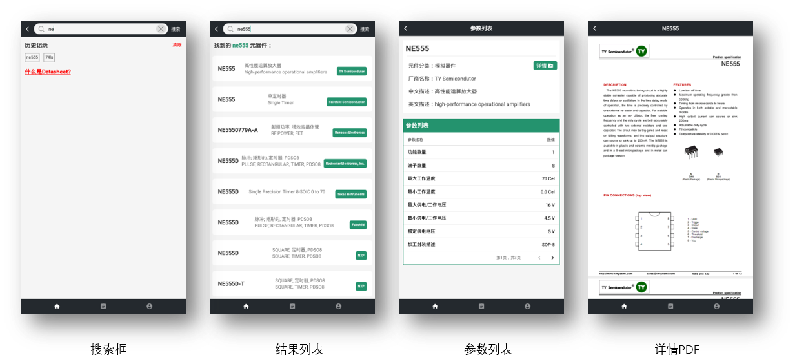

# 1. Init初始化
```javascript
npm i 
react-native run-android
```
# 2. 展示

## UI布局

## 2.1 首页
- ### 元器件查询

- ### 行业资讯

- ### 电阻计算器

## 2.2 项目
- ### 发布


- ### 列表


- ### 详情


- ### 动态更新


- ### 权限设置


## 2.3 我的


